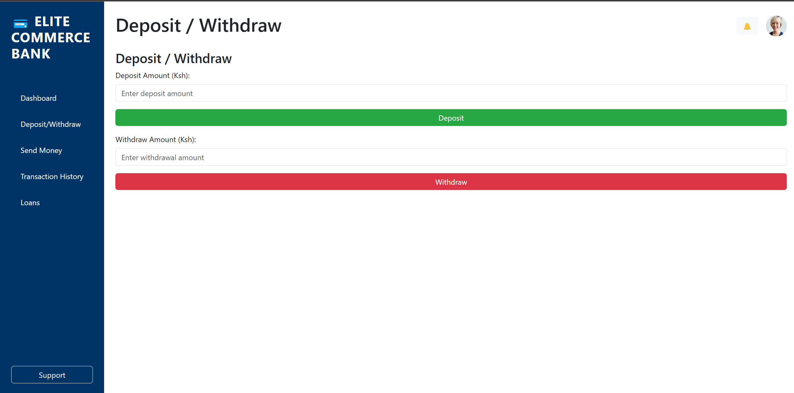
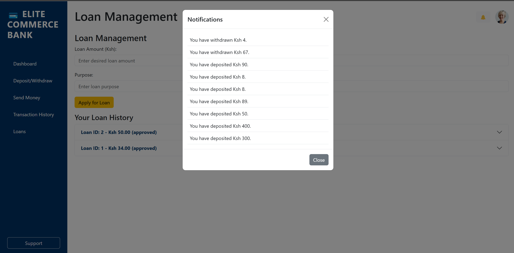
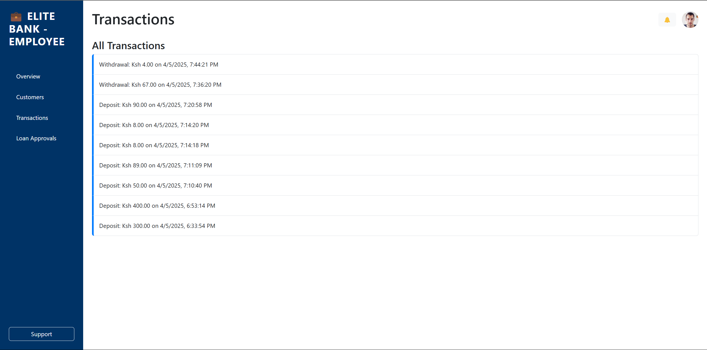

# Bank Management System

The Bank Management System is a full-stack application designed to manage banking operations efficiently. The project consists of a frontend and backend, featuring controllers, prototypes, routes, middlewares, and email functionality via Nodemailer. The system uses Supabase for its database needs.

---

## Table of Contents

1. [Overview](#overview)
2. [Features](#features)
3. [Technologies Used](#technologies-used)
4. [Installation](#installation)
5. [Environment Setup](#environment-setup)
6. [Running the Application](#running-the-application)
7. [Database Configuration (Supabase)](#database-configuration-supabase)
8. [ER Diagrams](#er-diagrams)
9. [Screenshots](#screenshots)
10. [Usage](#usage)

---

## Overview

The Bank Management System is built to streamline banking operations by integrating user account management, transaction processing, and automated email notifications. With a robust backend and a user-friendly frontend, this application ensures scalability and ease-of-maintenance.

---

## Features

- **User Authentication:** Secure login and registration.
- **Account Management:** Create, update, and manage bank accounts.
- **Transaction Handling:** Process deposits, withdrawals, and transfers.
- **Email Notifications:** Automated emails for account updates and alerts (using Nodemailer).
- **RESTful API:** Organized routes and controllers for clean separation of concerns.
- **Middleware Integration:** Enhanced security and data validation.

---

## Technologies Used

- **Frontend:** HTML, CSS, JavaScript
- **Backend:** Node.js, Express.js
- **Database:** Supabase (PostgreSQL)
- **Email Service:** Nodemailer
- **Architecture:** Controllers, Prototypes, Routes, Middlewares

---

## Installation

1. **Clone the Repository:**
   ```bash
   git clone https://github.com/willy-havertz/bank-management-system.git
   cd bank-management-system

2. **Install dependencies for the backend**
   ```bash
   cd backend
   npm install

## Environment setup

- create .env file in the backend directory

# Server Configuration
- PORT=5000

# Supabase Database
- DATABASE_URL=your_supabase_database_url
- SUPABASE_KEY=your_supabase_key

# Nodemailer Email Configuration
- EMAIL_HOST=smtp.example.com
- EMAIL_PORT=587
- EMAIL_USER=your_email@example.com
- EMAIL_PASS=your_email_password

## 🏃 Running the Application
  1. **Start the Backend Server**
  ```bash
  cd backend
  npm run dev

 2. **Access the application
 - Open you browser and navigate to
   [Elite commerce bank](https://bank-management-system-0udz.onrender.com)

## Database Configaration (Supabase)
The project uses Supabase for database management. Follow these steps to set up your database:

1. **Create a Supabase Account:**
 - Visit Supabase and sign up for an account
 - Create a new project to obtain your
 - DATABASE_URL and SUPABASE_KEY.

2. **Database Schema & Migrations:**
 - Use the SQL scripts provided in the /database/migrations folder to create tables and define the schema.
 - Optionally, seed initial data using the script in /database/seed.sql.

3. **Connect the Application:**
 - Ensure the DATABASE_URL and SUPABASE_KEY in your .env file are correctly set.

## Er Diagrams

## Usage
You can access the deployed app here:

👉 [Bank Management System](https://bank-management-system-0udz.onrender.com)

---

## 🧑‍💼 How to Use the Application

1. **Sign Up**
   - Visit the [Live Site](https://bank-management-system-0udz.onrender.com)
   - Fill in your details: Name, Email, Password, ID Number, and Phone Number

2. **Login**
   - Enter your email and password
   - Upon login, you’ll be redirected to your dashboard

3. **Dashboard Features**
   - 💳 View your account balance
   - 📤 Send Money to other users
   - 📥 Receive Money (get notified)
   - 💰 Deposit or Withdraw cash
   - 🏦 Apply for Loans
   - ✅ Approve/Reject Loans (if you’re an employee)

4. **Profile**
   - View and manage notifications

5. **Transaction Logs**
   - Monitor your deposits, withdrawals, and transfer history

---

> Powered by **Nodemailer** and integrated via Supabase backend triggers.


### Login Page


### About us


###  Dashboard View
.png)

### Contact Us


### Customer Accounts


### Deposit-Withdraw

### Employeee landing page

### Employee Login page

### Employee signup page

### Home page

### Loan approval

### Loan management

### Login page

### Notification

### Our features

### Profile picture

### Send money

### Signup page

### Transaction history

### Transactions

